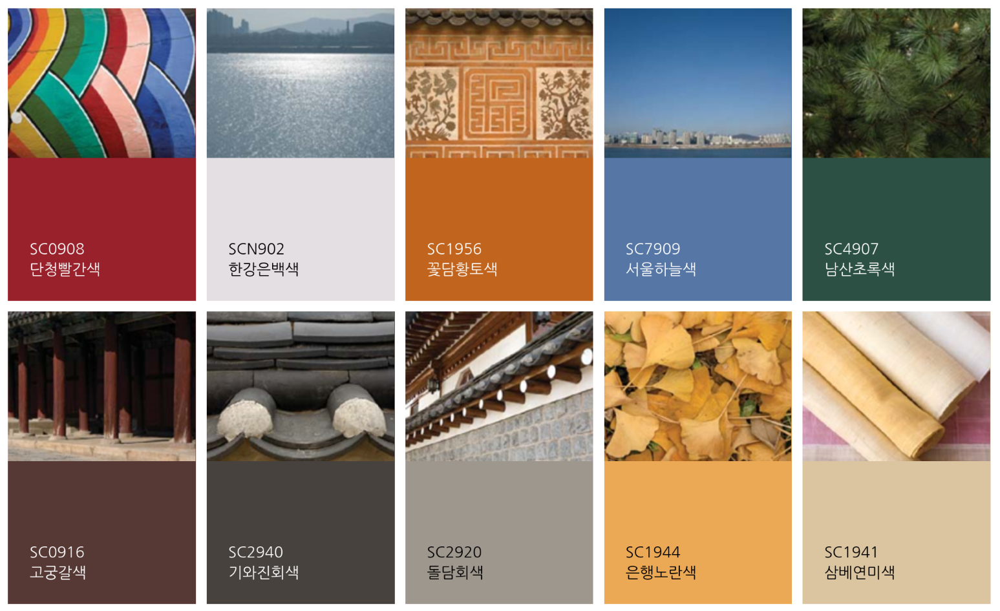
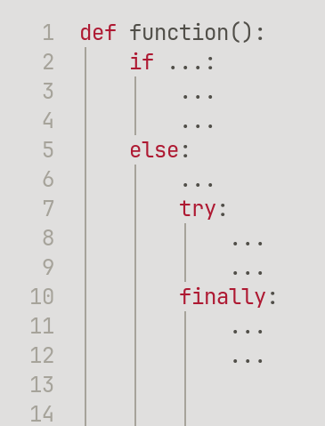

# Joseon

A code highlight theme featuring traditional colors of the Joseon dynasty.

The theme is subject to change.

## Supported Editors

- Helix: `helix.toml`
- VS Code: `vscode/joseon-theme.json`
- Zed: `zed/joseon.json`

### Zed Usage

Copy `zed/joseon.json` into your Zed themes directory and select **Joseon Light** in the theme picker.

## Colors

- Red: 단청빨간색 (Dancheong Red)
- White: 한강은백색 (Hangang Silver)
- Black: 기와진회색 (Giwa Dark Gray)
- Gray: 돌담회색 (Doldam Gray)
- Blue: 서울하늘색 (Seoul Skyblue)
- Green: 녹색(綠色) (Traditional Green)
- Orange: 꽃담황토색 (Kkotdam Ochre)

The exact RGB values of these colors are officialized by Seoul City and National Museum of Modern and Contemporary Art, Korea.

- 서울대표색 10 (Seoul Color 10)
- 한국전통 표준색 90선 (Korean Traditional Color Palette 90): 1991년 국립현대미술관이 발간한 「한국 전통 표준색명 및 색상」2차 시안 자료집의 Munsell 값을 중앙대학교와 문은배 색체디자인연구소가 개발한 디지털 색채 팔레트를 이용하여 변환

## Code Highlights

The red represents the control flows.
They are dark and heavy, which helps you parse the code structure at a glance.

The green represents the constants.
They are not very assertive, yet they are readable and helpful to locate the constants.

The gray represents the non-primary contents like comments, line numbers, inlay-hints.

The orange represents the storage keywords.
They do not have the enough contrast from the background, but there are only a few fixed set of strings so the reader does not have to read them carefully.

The blue represents the local variables and special keywords.

## Design Choices

- Light Theme
- Low-contrast background
  - The pure white is too much light on a large monitor.
  - The traditional Korean white is not a pure white, but colors of nature.
    [소색비무색(素色非無色), 흰옷에 깃든 빛깔](https://www.nfm.go.kr/user/museumbbs/home/3/1274/selectMuseumBbsView.do?museumBbsIdx=12955&page=1&row=12)
- There is no yellow because the color has not enough contrast from the background.
- There is no cyan because it's not perceptually differentiable enough from Green or Blue to quickly scan for constants or special keywords.
- The traditional colors are used as-is. The colors are not adjusted to meet the WCGA guide or the symmetry in some color space.
- The understated highlight: many colors do not help read the code.

## Contrast

For small font sizes, it is recommended to lower the lightness of Blue and Green by 10% in the OKLAB space.
